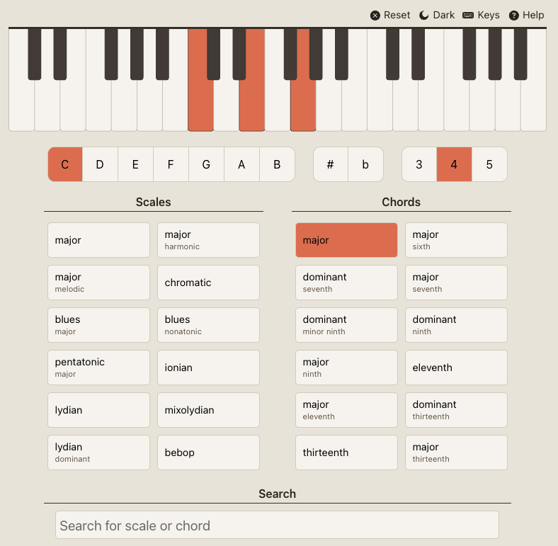

# Diatonic

Diatonic is a web site providing lookup and reverse lookup of scales and chords
using an interactive piano component.

It was built using [kamasi](https://github.com/vegardege/kamasi) for music
theory and [diatonic-piano](https://github.com/vegardege/diatonic-piano) for
interactivity.

## Screenshot

